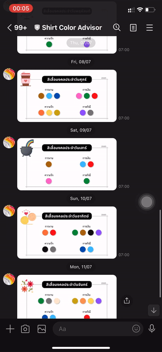

# :shirt: Shirt Color Advisor Bot :shirt:

This project is to build a simple broadcast bot in `Line` messaging platform. What this bot does is giving an advice which color of your shirt is good to wear on that day, at 6:00 AM every morning.

## :running: How to deploy :running:

This bot is running in `Google Cloud Function` on my personal account. This function is just to broadcast a today's picture in `resources` directory to all users, which consists of 2 files

1. `google_cloud_function.py` which is the main function file
2. `requirements` which is the dependency file

Once this function is deployed and ready to use. I set up the `Google Cloud Scheduler` to trigger this function at the 6:00 AM everyday.
